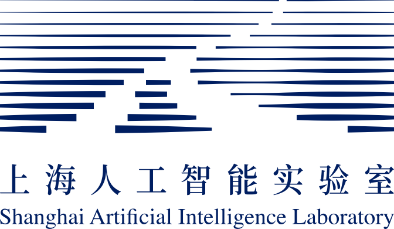

  I am currently a Ph.D. candidate under the supervision of 
  <a href="https://personal.ntu.edu.sg/tianwei.zhang/" target="_blank" style="text-decoration: none;">Prof. Tianwei Zhang</a> 
  at S-Lab, College of Computing and Data Science of 
  <a href="https://www.ntu.edu.sg/computing" target="_blank" style="text-decoration: none;">Nanyang Technological University</a>, 
  Singapore. Before that, I received my M.Sc. degree in Electrical Engineering from 
  <a href="https://www.nus.edu.sg/" target="_blank" style="text-decoration: none;">National University of Singapore</a> 
  in 2022 and my B.Eng. degree in Information Engineering from 
  <a href="https://www.zju.edu.cn/english/" target="_blank" style="text-decoration: none;">Zhejiang University</a> 
  in 2020. 
  
  <b>Email</b>: meng.zhang@ntu.edu.sg
  

<!-- I am currently a Ph.D. candidate under the supervision of [Prof. Tianwei Zhang](https://personal.ntu.edu.sg/tianwei.zhang/) at S-Lab, [College of Computing and Data Science of Nanyang Technological University](https://www.ntu.edu.sg/computing), Singapore. Before that, I received my M.Sc. degree in Electrical Engineering from [National University of Singapore](https://www.nus.edu.sg/) in 2022 and my B.Eng. degree in Information Engineering from [Zhejiang University](https://www.zju.edu.cn/english/) in 2020.  -->

Research Interests
======
- Distributed Training
- Systems for Graph Learning
- Machine Learning for Systems

Publications
======

  <b>TorchGT: A Holistic System for Large-scale Graph Transformer Training</b> 
  <b>Meng Zhang</b>*, Jie Sun*, Qinghao Hu, Peng Sun, Zeke Wang, Yonggang Wen, Tianwei Zhang 
  <i>Proceedings of the International Conference for High Performance Computing, Networking, Storage and Analysis (<b>SC</b>), 2024</i> &nbsp;<em class="blue"></em> 
  <a href="https://sc24.conference-program.com/presentation/?id=pap224&sess=sess396" target="_blank" style="text-decoration: none;">[Paper]</a>
  <!-- <a href="https://github.com/zxmeng98/torchgt" target="_blank" style="text-decoration: none;">[Code]</a>  -->

  <b>Sylvie: 3D-adaptive and Universal System for Large-scale Graph Neural Network Training</b> 
  <b>Meng Zhang</b>, Qinghao Hu, Cheng Wan, Haozhao Wang, Peng Sun, Yonggang Wen, Tianwei Zhang 
  <i>IEEE International Conference on Data Engineering (<b>ICDE</b>), 2024</i> 
  <a href="../files/Sylvie_ICDE24_camera_ready.pdf" target="_blank" style="text-decoration: none;">[Paper]</a>
  <a href="https://github.com/zxmeng98/Sylvie" target="_blank" style="text-decoration: none;">[Code]</a> 

  <b>Characterization of Large Language Model Development in the Datacenter</b> 
  Qinghao Hu*, Zhisheng Ye*, Zerui Wang*, Guoteng Wang, <b>Meng Zhang</b>, Qiaoling Chen, Peng Sun, Dahua Lin, Xiaolin Wang, Yingwei Luo, Yonggang Wen, Tianwei Zhang 
  <i>USENIX Symposium on Networked Systems Design and Implementation (<b>NSDI</b>), 2024</i> 
  <a href="https://www.usenix.org/system/files/nsdi24-hu.pdf" target="_blank" style="text-decoration: none;">[Paper]</a>
  <!-- <a href="" target="_blank" style="text-decoration: none;">[Code]</a>  -->

  <b>FedDSE: Distribution-aware Sub-model Extraction for Federated Learning over Resource-constrained Devices</b> 
  Haozhao Wang, Yabo Jia, <b>Meng Zhang</b>, Qinghao Hu, Hao Ren, Peng Sun, Yonggang Wen, Tianwei Zhang 
  <i>The Web Conference (<b>WWW</b>), 2024</i> 
  <a href="https://dl.acm.org/doi/10.1145/3589334.3645416" target="_blank" style="text-decoration: none;">[Paper]</a>
  <!-- <a href="" target="_blank" style="text-decoration: none;">[Code]</a>  -->

  <b>Lucid: A non-intrusive, scalable and interpretable scheduler for deep learning training jobs</b> 
  Qinghao Hu*, <b>Meng Zhang</b>*, Peng Sun, Yonggang Wen, and Tianwei Zhang 
  <i>Architectural Support for Programming Languages and Operating Systems (<b>ASPLOS</b>), 2023</i>  
  <em class="blue"><b style="color: red;">Distinguished Paper Award</b></em> 
  <a href="https://dl.acm.org/doi/pdf/10.1145/3575693.3575705" target="_blank" style="text-decoration: none;">[Paper]</a>
  <a href="https://github.com/S-Lab-System-Group/Lucid" target="_blank" style="text-decoration: none;">[Code]</a> 

  <b>Hydro: Surrogate-based Hyperparameter Tuning Service in Datacenters</b> 
  Qinghao Hu, Zhisheng Ye, <b>Meng Zhang</b>, Qiaoling Chen, Peng Sun, Yonggang Wen, Tianwei Zhang 
  <i>USENIX Symposium on Operating Systems Design and Implementation (<b>OSDI</b>), 2023</i> 
  <a href="https://www.usenix.org/system/files/osdi23-hu.pdf" target="_blank" style="text-decoration: none;">[Paper]</a>
  <a href="https://github.com/S-Lab-System-Group/Hydro" target="_blank" style="text-decoration: none;">[Code]</a> 

Preprint
------

  <b>Boosting Distributed Full-graph GNN Training with Asynchronous One-bit Communication</b> 
  <b>Meng Zhang</b>, Qinghao Hu, Peng Sun, Yonggang Wen, Tianwei Zhang 
  <i>arXiv, 2023</i> 
  <a href="https://arxiv.org/abs/2303.01277" target="_blank" style="text-decoration: none;">[Paper]</a>
  <!-- <a href="https://github.com/S-Lab-System-Group/Hydro" target="_blank" style="text-decoration: none;">[Code]</a>  -->

Experiences
======

  
  

    <b>System Research Intern</b> | <a href="https://nds-shlab.github.io/" target="_blank" style="text-decoration: none;">NDS Group @ Shanghai AI Lab</a> 
    Jun 2023 - present
  

  
  

    <b>Research Intern</b> | Tencent JARVIS Lab 
    Oct 2020 - Feb 2021
  

  
  

    <b>Research Intern</b> | Singapore University of Technology and Design 
    Advisor: <a href="https://simonperrault.github.io/" target="_blank" style="text-decoration: none;">Prof. Simon Perrault</a> 
    Jul 2019 - Sept 2021
  

<!-- 

 -->

Professional Services
======

  <b>[EuroSys 2023]</b> Shadow Committee Member 
  <b>[ATC 2023]</b> AE Committee Member

<!-- Awards
======
<li>Distinguished Paper Award of ASPLOS, 2023.</li>
<li>Student Travel Grant of OSDI, 2023.</li> -->